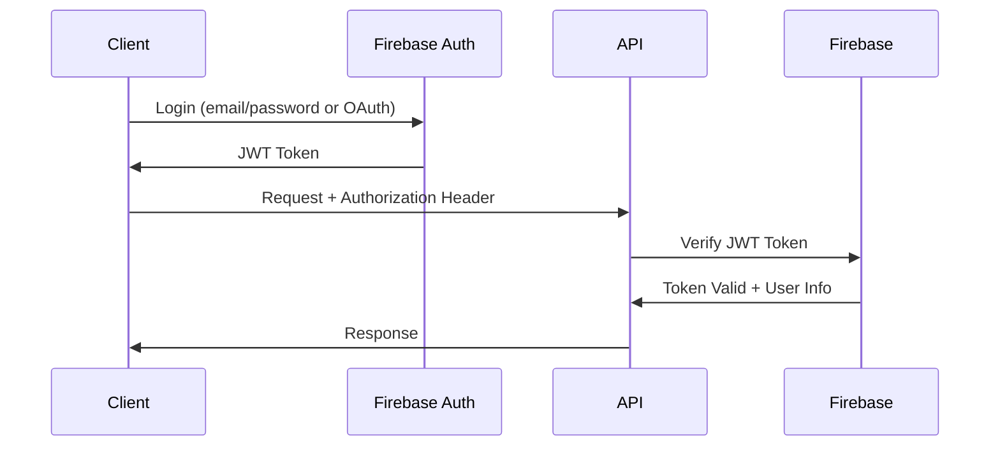

# MyNook API Design Specification

## Overview
MyNook's REST API provides secure access to workspace and card management functionality. Built with .NET Core 6+, it follows RESTful principles with Firebase JWT authentication.

## Base Configuration

### Base URL
```
Development: https://localhost:5001/api/v1
Production:  https://mynook.example.com/api/v1
```

### Content Type
- **Request**: `application/json`
- **Response**: `application/json`
- **File Upload**: `multipart/form-data`

### Versioning
- **Strategy**: URL path versioning (`/api/v1/`)
- **Current Version**: v1
- **Backward Compatibility**: Maintained for 2 major versions

## Authentication & Authorization

### Authentication Flow


### Authorization Header
```http
Authorization: Bearer <firebase-jwt-token>
```

### Token Validation
- **Provider**: Firebase Admin SDK
- **Validation**: Signature, expiration, issuer verification
- **User Context**: Extract `uid`, `email`, `email_verified` from token
- **Session Management**: Stateless JWT validation on each request

## API Endpoints

### Authentication Endpoints

#### Verify Token
```http
GET /api/v1/auth/verify
Authorization: Bearer <jwt-token>
```

**Response (200)**:
```json
{
  "success": true,
  "data": {
	"uid": "firebase-user-id",
	"email": "user@example.com",
	"emailVerified": true,
	"displayName": "John Doe"
  }
}
```

#### Refresh User Profile
```http
POST /api/v1/auth/profile/refresh
Authorization: Bearer <jwt-token>
```

**Response (200)**:
```json
{
  "success": true,
  "message": "Profile updated from Firebase"
}
```

### User Management Endpoints

#### Get User Profile
```http
GET /api/v1/users/me
Authorization: Bearer <jwt-token>
```

**Response (200)**:
```json
{
  "success": true,
  "data": {
	"id": "firebase-user-id",
	"email": "user@example.com",
	"displayName": "John Doe",
	"photoURL": "https://...",
	"createdAt": "2025-01-25T10:00:00Z",
	"lastLoginAt": "2025-01-25T14:30:00Z",
	"preferences": {
	  "theme": "dark",
	  "gridSnap": true,
	  "autoSave": false
	}
  }
}
```

#### Update User Preferences
```http
PATCH /api/v1/users/me/preferences
Authorization: Bearer <jwt-token>
Content-Type: application/json
```

**Request Body**:
```json
{
  "theme": "dark",
  "gridSnap": true,
  "autoSave": false,
  "defaultWorkspace": "workspace-id"
}
```

**Response (200)**:
```json
{
  "success": true,
  "message": "Preferences updated successfully"
}
```

### Workspace Management Endpoints

#### Get User Workspaces
```http
GET /api/v1/workspaces
Authorization: Bearer <jwt-token>
```

**Query Parameters**:
- `page` (optional): Page number (default: 1)
- `limit` (optional): Items per page (default: 10, max: 50)
- `sort` (optional): Sort field (`name`, `lastModified`, `createdAt`)
- `order` (optional): Sort order (`asc`, `desc`)
- `active` (optional): Filter by active status (`true`, `false`)

**Response (200)**:
```json
{
  "success": true,
  "data": {
	"workspaces": [
	  {
		"id": "workspace-id",
		"name": "My Dashboard",
		"description": "Personal productivity workspace",
		"createdAt": "2025-01-25T10:00:00Z",
		"lastModified": "2025-01-25T14:30:00Z",
		"cardCount": 5,
		"settings": {
		  "gridSize": {
			"width": 50,
			"height": 30,
			"unit": 32
		  },
		  "backgroundColor": "#ffffff"
		}
	  }
	],
	"pagination": {
	  "currentPage": 1,
	  "totalPages": 2,
	  "totalItems": 15,
	  "itemsPerPage": 10
	}
  }
}
```

#### Get Workspace by ID
```http
GET /api/v1/workspaces/{workspaceId}
Authorization: Bearer <jwt-token>
```

**Response (200)**:
```json
{
  "success": true,
  "data": {
	"id": "workspace-id",
	"name": "My Dashboard",
	"description": "Personal productivity workspace",
	"ownerId": "firebase-user-id",
	"createdAt": "2025-01-25T10:00:00Z",
	"lastModified": "2025-01-25T14:30:00Z",
	"cardCount": 5,
	"settings": {
	  "gridSize": {
		"width": 50,
		"height": 30,
		"unit": 32
	  },
	  "backgroundColor": "#ffffff",
	  "backgroundImage": null
	}
  }
}
```

#### Create Workspace
```http
POST /api/v1/workspaces
Authorization: Bearer <jwt-token>
Content-Type: application/json
```

**Request Body**:
```json
{
  "name": "New Workspace",
  "description": "Optional description",
  "settings": {
	"gridSize": {
	  "width": 50,
	  "height": 30,
	  "unit": 32
	},
	"backgroundColor": "#ffffff"
  }
}
```

**Response (201)**:
```json
{
  "success": true,
  "data": {
	"id": "new-workspace-id",
	"name": "New Workspace",
	"ownerId": "firebase-user-id",
	"createdAt": "2025-01-25T15:00:00Z"
  }
}
```

#### Update Workspace
```http
PUT /api/v1/workspaces/{workspaceId}
Authorization: Bearer <jwt-token>
Content-Type: application/json
```

**Request Body**:
```json
{
  "name": "Updated Workspace Name",
  "description": "Updated description",
  "settings": {
	"backgroundColor": "#f0f0f0"
  }
}
```

**Response (200)**:
```json
{
  "success": true,
  "message": "Workspace updated successfully"
}
```

#### Delete Workspace
```http
DELETE /api/v1/workspaces/{workspaceId}
Authorization: Bearer <jwt-token>
```

**Response (200)**:
```json
{
  "success": true,
  "message": "Workspace deleted successfully"
}
```

### Card Management Endpoints

#### Get Workspace Cards
```http
GET /api/v1/workspaces/{workspaceId}/cards
Authorization: Bearer <jwt-token>
```

**Query Parameters**:
- `type` (optional): Filter by card type
- `sort` (optional): Sort field (`position`, `lastModified`, `createdAt`)

**Response (200)**:
```json
{
  "success": true,
  "data": {
	"cards": [
	  {
		"id": "card-id",
		"workspaceId": "workspace-id",
		"type": "text_note",
		"title": "Meeting Notes",
		"position": {
		  "x": 0,
		  "y": 0,
		  "width": 4,
		  "height": 3
		},
		"style": {
		  "backgroundColor": "#ffeb3b",
		  "textColor": "#000000"
		},
		"createdAt": "2025-01-25T10:00:00Z",
		"lastModified": "2025-01-25T14:30:00Z"
	  }
	]
  }
}
```

#### Get Card by ID
```http
GET /api/v1/cards/{cardId}
Authorization: Bearer <jwt-token>
```

**Response (200)**:
```json
{
  "success": true,
  "data": {
	"id": "card-id",
	"workspaceId": "workspace-id",
	"type": "text_note",
	"title": "Meeting Notes",
	"content": {
	  "text": "## Important Discussion Points\n- Budget review\n- Timeline updates",
	  "format": "markdown",
	  "fontSize": 14,
	  "fontFamily": "Arial"
	},
	"position": {
	  "x": 0,
	  "y": 0,
	  "width": 4,
	  "height": 3
	},
	"style": {
	  "backgroundColor": "#ffeb3b",
	  "textColor": "#000000",
	  "borderRadius": 8
	},
	"createdAt": "2025-01-25T10:00:00Z",
	"lastModified": "2025-01-25T14:30:00Z",
	"version": 3
  }
}
```

#### Create Card
```http
POST /api/v1/workspaces/{workspaceId}/cards
Authorization: Bearer <jwt-token>
Content-Type: application/json
```

**Request Body**:
```json
{
  "type": "text_note",
  "title": "New Note",
  "content": {
	"text": "Initial content",
	"format": "plain",
	"fontSize": 14,
	"fontFamily": "Arial"
  },
  "position": {
	"x": 2,
	"y": 2,
	"width": 3,
	"height": 2
  },
  "style": {
	"backgroundColor": "#ffffff",
	"textColor": "#000000"
  }
}
```

**Response (201)**:
```json
{
  "success": true,
  "data": {
	"id": "new-card-id",
	"workspaceId": "workspace-id",
	"createdAt": "2025-01-25T15:00:00Z"
  }
}
```

#### Update Card
```http
PUT /api/v1/cards/{cardId}
Authorization: Bearer <jwt-token>
Content-Type: application/json
```

**Request Body**:
```json
{
  "title": "Updated Title",
  "content": {
	"text": "Updated content",
	"format": "markdown"
  },
  "position": {
	"x": 3,
	"y": 3,
	"width": 4,
	"height": 3
  },
  "version": 3
}
```

**Response (200)**:
```json
{
  "success": true,
  "message": "Card updated successfully",
  "data": {
	"version": 4
  }
}
```

#### Bulk Update Cards
```http
PATCH /api/v1/workspaces/{workspaceId}/cards
Authorization: Bearer <jwt-token>
Content-Type: application/json
```

**Request Body**:
```json
{
  "operations": [
	{
	  "cardId": "card-1",
	  "action": "move",
	  "position": {
		"x": 5,
		"y": 5,
		"width": 3,
		"height": 2
	  },
	  "version": 2
	},
	{
	  "cardId": "card-2",
	  "action": "update",
	  "style": {
		"backgroundColor": "#e1f5fe"
	  },
	  "version": 1
	}
  ]
}
```

**Response (200)**:
```json
{
  "success": true,
  "data": {
	"updated": ["card-1", "card-2"],
	"failed": []
  }
}
```

#### Delete Card
```http
DELETE /api/v1/cards/{cardId}
Authorization: Bearer <jwt-token>
```

**Response (200)**:
```json
{
  "success": true,
  "message": "Card deleted successfully"
}
```

### File Upload Endpoints

#### Upload Image for Card
```http
POST /api/v1/cards/{cardId}/upload
Authorization: Bearer <jwt-token>
Content-Type: multipart/form-data
```

**Form Data**:
- `file`: Image file (max 10MB)
- `altText`: Alternative text for accessibility

**Response (200)**:
```json
{
  "success": true,
  "data": {
	"imageUrl": "https://firebase-storage-url/image.jpg",
	"fileSize": 2048576,
	"dimensions": {
	  "width": 1920,
	  "height": 1080
	}
  }
}
```

## Error Handling

### Standard Error Response
```json
{
  "success": false,
  "error": {
	"code": "VALIDATION_ERROR",
	"message": "Invalid input data",
	"details": {
	  "field": "name",
	  "reason": "Name must be between 1 and 100 characters"
	},
	"timestamp": "2025-01-25T15:30:00Z",
	"requestId": "req-12345"
  }
}
```

### HTTP Status Codes
- **200**: Success
- **201**: Created
- **400**: Bad Request (validation errors)
- **401**: Unauthorized (invalid/missing token)
- **403**: Forbidden (insufficient permissions)
- **404**: Not Found
- **409**: Conflict (resource conflict)
- **422**: Unprocessable Entity (business logic error)
- **429**: Too Many Requests (rate limited)
- **500**: Internal Server Error

### Error Codes
```typescript
enum ErrorCode {
  // Authentication
  INVALID_TOKEN = 'INVALID_TOKEN',
  TOKEN_EXPIRED = 'TOKEN_EXPIRED',
  INSUFFICIENT_PERMISSIONS = 'INSUFFICIENT_PERMISSIONS',
  
  // Validation
  VALIDATION_ERROR = 'VALIDATION_ERROR',
  MISSING_REQUIRED_FIELD = 'MISSING_REQUIRED_FIELD',
  INVALID_FORMAT = 'INVALID_FORMAT',
  
  // Business Logic
  WORKSPACE_LIMIT_EXCEEDED = 'WORKSPACE_LIMIT_EXCEEDED',
  CARD_LIMIT_EXCEEDED = 'CARD_LIMIT_EXCEEDED',
  POSITION_CONFLICT = 'POSITION_CONFLICT',
  VERSION_CONFLICT = 'VERSION_CONFLICT',
  
  // Resources
  RESOURCE_NOT_FOUND = 'RESOURCE_NOT_FOUND',
  RESOURCE_ALREADY_EXISTS = 'RESOURCE_ALREADY_EXISTS',
  
  // System
  INTERNAL_ERROR = 'INTERNAL_ERROR',
  SERVICE_UNAVAILABLE = 'SERVICE_UNAVAILABLE',
  RATE_LIMIT_EXCEEDED = 'RATE_LIMIT_EXCEEDED'
}
```

## Rate Limiting

### Rate Limits by Endpoint Type
```yaml
Authentication:
  - GET /auth/verify: 60 requests/minute
  - POST /auth/profile/refresh: 10 requests/minute

User Management:
  - GET /users/me: 30 requests/minute
  - PATCH /users/me/preferences: 10 requests/minute

Workspace Operations:
  - GET /workspaces: 30 requests/minute
  - POST /workspaces: 5 requests/minute
  - PUT /workspaces/{id}: 20 requests/minute
  - DELETE /workspaces/{id}: 5 requests/minute

Card Operations:
  - GET /workspaces/{id}/cards: 60 requests/minute
  - POST /workspaces/{id}/cards: 20 requests/minute
  - PUT /cards/{id}: 60 requests/minute
  - PATCH /workspaces/{id}/cards: 30 requests/minute
  - DELETE /cards/{id}: 20 requests/minute

File Upload:
  - POST /cards/{id}/upload: 10 requests/minute
```

### Rate Limit Headers
```http
X-RateLimit-Limit: 60
X-RateLimit-Remaining: 45
X-RateLimit-Reset: 1706188800
X-RateLimit-Window: 60
```

### Rate Limit Response (429)
```json
{
  "success": false,
  "error": {
	"code": "RATE_LIMIT_EXCEEDED",
	"message": "Too many requests. Please try again later.",
	"details": {
	  "limit": 60,
	  "window": 60,
	  "retryAfter": 15
	}
  }
}
```

## Request Validation

### Workspace Validation
```csharp
public class CreateWorkspaceRequest
{
	[Required]
	[StringLength(100, MinimumLength = 1)]
	public string Name { get; set; }
	
	[StringLength(500)]
	public string Description { get; set; }
	
	[Required]
	public WorkspaceSettings Settings { get; set; }
}

public class WorkspaceSettings
{
	[Required]
	public GridSize GridSize { get; set; }
	
	[Required]
	[RegularExpression(@"^#[0-9A-Fa-f]{6}$")]
	public string BackgroundColor { get; set; }
}
```

### Card Validation
```csharp
public class CreateCardRequest
{
	[Required]
	[EnumDataType(typeof(CardType))]
	public CardType Type { get; set; }
	
	[Required]
	[StringLength(200, MinimumLength = 1)]
	public string Title { get; set; }
	
	[Required]
	public Position Position { get; set; }
	
	[Required]
	public object Content { get; set; } // Validated based on Type
}

public class Position
{
	[Range(0, int.MaxValue)]
	public int X { get; set; }
	
	[Range(0, int.MaxValue)]
	public int Y { get; set; }
	
	[Range(2, 8)]
	public int Width { get; set; }
	
	[Range(2, 8)]
	public int Height { get; set; }
}
```

## Security Considerations

### Input Sanitization
- **XSS Prevention**: HTML encoding for all text content
- **SQL Injection**: Parameterized queries (Firestore automatically handles)
- **File Upload**: MIME type validation, virus scanning
- **URL Validation**: Whitelist allowed domains for iframe content

### CORS Configuration
```csharp
services.AddCors(options =>
{
	options.AddPolicy("AllowFrontend", builder =>
	{
		builder
			.WithOrigins("https://mynook.example.com", "http://localhost:4200")
			.AllowAnyMethod()
			.AllowAnyHeader()
			.AllowCredentials();
	});
});
```

### Security Headers
```http
Strict-Transport-Security: max-age=31536000; includeSubDomains
X-Content-Type-Options: nosniff
X-Frame-Options: DENY
X-XSS-Protection: 1; mode=block
Content-Security-Policy: default-src 'self'; script-src 'self' 'unsafe-inline'
```

## Performance Optimization

### Caching Strategy
- **Response Caching**: Cache GET responses for 5 minutes
- **ETags**: Support conditional requests
- **Compression**: Gzip compression for responses > 1KB
- **CDN**: Static assets served from CDN

### Database Optimization
- **Connection Pooling**: Firestore connection management
- **Query Optimization**: Efficient Firestore queries
- **Pagination**: Limit result sets to prevent large responses
- **Lazy Loading**: Load card content only when requested

## Monitoring & Logging

### Request Logging
```json
{
  "timestamp": "2025-01-25T15:30:00Z",
  "requestId": "req-12345",
  "method": "GET",
  "path": "/api/v1/workspaces",
  "userId": "firebase-user-id",
  "duration": 245,
  "statusCode": 200,
  "userAgent": "Mozilla/5.0...",
  "ip": "192.168.1.1"
}
```

### Error Logging
```json
{
  "timestamp": "2025-01-25T15:30:00Z",
  "requestId": "req-12345",
  "level": "ERROR",
  "message": "Card position conflict detected",
  "userId": "firebase-user-id",
  "workspaceId": "workspace-id",
  "cardId": "card-id",
  "stackTrace": "...",
  "context": {
	"requestedPosition": { "x": 5, "y": 5 },
	"conflictingCardId": "other-card-id"
  }
}
```

### Health Check Endpoint
```http
GET /api/health
```

**Response (200)**:
```json
{
  "status": "healthy",
  "timestamp": "2025-01-25T15:30:00Z",
  "version": "1.0.0",
  "services": {
	"firebase": "healthy",
	"database": "healthy"
  }
}
``` 